# 인천 문화관광 웹 애플리케이션 개발

> 인천의 문화·관광 정보를 한눈에 확인하고, 회원 기능과 게시판 기능까지 함께 제공하는 Spring Boot 기반 웹 애플리케이션입니다.

\---

## 1\. 프로젝트 소개

본 프로젝트는 인천 지역의 문화·관광 정보를 효과적으로 제공하기 위해 개발한 웹 애플리케이션입니다.  
사용자는 관광지, 문화행사, 문화공간, 교통, 맛집·숙박·쇼핑 정보를 카테고리별로 확인할 수 있으며,  
회원가입 및 로그인 후 리뷰 게시판과 마이페이지 기능을 이용할 수 있습니다.  
관리자는 공지사항 게시판과 회원 관련 기능을 관리할 수 있습니다.

정적 퍼블리싱 결과물을 기반으로, Spring Boot 3와 Thymeleaf를 적용한 동적 웹 애플리케이션으로 확장하였으며,  
PostgreSQL 연동을 통해 회원 및 게시판 데이터를 관리하도록 구현하였습니다.

\---

## 2\. 팀 소개

### 3팀 연연생트리오

* **팀리더** : 김민진
* **팀원** : 김민진, 박재웅, 김진수

\---

## 3\. 프로젝트 개요

* **프로젝트명** : 인천 문화관광 웹 애플리케이션 개발
* **개발 형태** : 팀 프로젝트
* **개발 목적**

  * 인천 지역의 문화·관광 정보를 사용자 친화적으로 제공
  * 회원 기능과 게시판 기능을 결합한 웹 서비스 구현
  * Spring Boot 기반 MVC 패턴 및 데이터베이스 연동 경험 확보
  * 실제 서비스 형태의 관광 정보 웹 애플리케이션 개발 역량 강화

\---

## 4\. 관련 링크

* **깃허브(프런트엔드 페이지 및 소스코드)**  
https://teamweb802.github.io/teamweb01/
* **깃허브(백엔드 + 프런트엔드 소스코드)**  
https://github.com/teamweb802/teamweb01
* **산출물(노션)**  
https://www.notion.so/15972bc8fbb78217aaa601ec207feadf?source=copy\_link
* **클라우드(도커 이미지)**  
teamweb802/tour-incheon:1.0

\---

## 5\. 개발 환경

### Backend

* Spring Boot 3
* Zulu OpenJDK Java 21
* Spring Web
* Spring Data JPA
* Spring Security
* Thymeleaf

### Database

* PostgreSQL

### Frontend

* HTML5
* CSS3
* JavaScript
* Thymeleaf Template Engine

### Build Tool

* Gradle

### Infra

* Docker

### Version Control

* Git
* GitHub

\---

## 6\. 주요 기능

### 6-1. 관광 및 문화 정보 제공

* 인천 안내
* 테마여행
* 문화관광
* 길라잡이(교통)
* 맛집·숙박·쇼핑

### 6-2. 회원 기능

* 회원가입
* 로그인 / 로그아웃
* 마이페이지 조회 및 수정
* 회원 탈퇴
* 아이디 중복 확인

### 6-3. 공지사항 게시판

* 공지사항 목록 조회
* 공지사항 상세 조회
* 공지사항 작성 / 수정 / 삭제
* 검색 기능
* 첨부파일 업로드
* 관리자 권한 제어

### 6-4. 리뷰 게시판

* 리뷰 목록 조회
* 리뷰 상세 조회
* 리뷰 작성 / 수정 / 삭제
* 검색 기능
* 첨부파일 업로드
* 로그인 사용자 전용 기능
* 작성자 본인 권한 기반 수정/삭제 제어

### 6-5. 정책 페이지

* 개인정보처리방침
* 저작권보호정책

\---

## 7\. 기술적 특징

* Spring Boot 기반 MVC 패턴 적용
* Thymeleaf를 이용한 서버 사이드 렌더링
* Spring Security를 통한 비회원 / 회원 / 관리자 권한 분리
* PostgreSQL 및 JPA 기반 데이터 관리
* 공지사항 및 리뷰 게시판 파일 첨부 기능 구현
* 정적 퍼블리싱 결과물을 백엔드 구조와 통합하여 실제 서비스형 웹 애플리케이션 형태로 확장
* Docker 이미지 기반 배포를 고려한 실행 환경 구성

\---

## 8\. 시스템 권한 구성

|구분|권한|
|-|-|
|비회원|메인 페이지, 관광 정보, 정책 페이지, 공지사항 조회|
|회원|리뷰 작성/수정/삭제, 마이페이지 이용|
|관리자|공지사항 작성/수정/삭제, 회원 관리|

\---

## 9\. 프로젝트 구조

```bash
teamweb01/
├── incheon/
│   ├── build.gradle
│   ├── src/main/java/com/example/tour
│   │   ├── config
│   │   ├── controller
│   │   ├── domain
│   │   ├── dto
│   │   ├── repository
│   │   ├── service
│   │   └── util
│   ├── src/main/resources
│   │   ├── templates
│   │   │   ├── member
│   │   │   ├── notice
│   │   │   ├── review
│   │   │   ├── policy
│   │   │   ├── spot
│   │   │   └── index.html
│   │   ├── static
│   │   └── application.yaml
│   └── gradlew
├── gif/
│   ├── admin\_1.gif
│   ├── admin\_2.gif
│   ├── admin\_3.gif
│   ├── join.gif
│   ├── login.gif
│   ├── main\_1.gif
│   ├── main\_2.gif
│   ├── main\_3.gif
│   ├── main\_4.gif
│   ├── main\_5.gif
│   ├── not\_login.gif
│   ├── review\_1.gif
│   ├── review\_2.gif
│   ├── mypage\_1.gif
│   └── sub\_1.gif
├── README.md
└── 기타 프런트엔드 정적 파일
```

\---

## 10\. 실행 방법

### 10-1. PostgreSQL 데이터베이스 생성

```sql
CREATE DATABASE incheon;
```

### 10-2. application.yaml 설정 확인

`src/main/resources/application.yaml` 파일에서 데이터베이스 접속 정보와 포트를 확인합니다.

예시:

```yaml
spring:
  datasource:
    url: jdbc:postgresql://localhost:5432/incheon
    username: postgres
    password: 1004
```

### 10-3. 프로젝트 실행

```bash
cd incheon
./gradlew bootRun
```

Windows 환경:

```bash
cd incheon
gradlew.bat bootRun
```

### 10-4. 접속 주소

```bash
http://localhost:8184
```

\---

## 11\. Docker 이미지 실행

본 프로젝트는 Docker 이미지 형태로 배포하여 컨테이너 기반으로 실행할 수 있습니다.  
도커 이미지 링크 등록 후 아래와 같은 방식으로 실행할 수 있습니다.

```bash
docker pull teamweb802/tour-incheon:1.0
docker run -p 8184:8184 tour-incheon:1.0
```

\---

## 12. 주요 기능 시연

> 아래 GIF 파일은 `README.md`와 동일한 위치의 `gif/` 폴더를 기준으로 호출됩니다.

### 12-1. 메인 화면
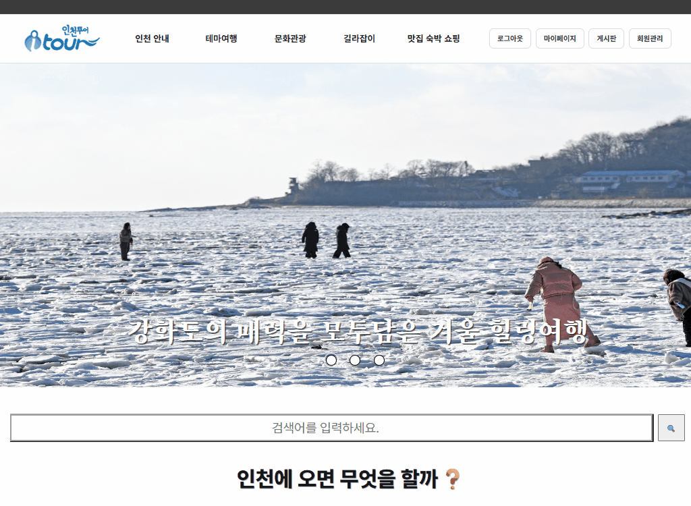

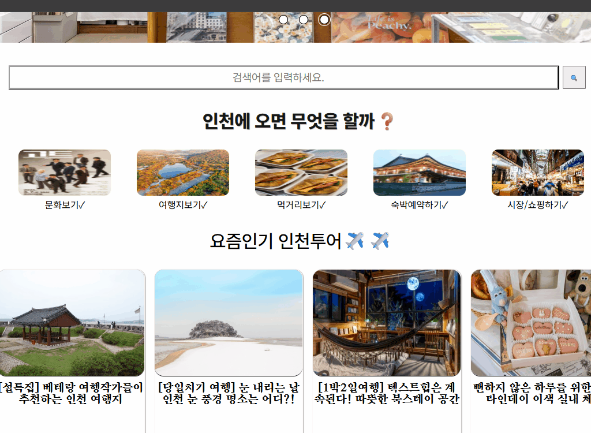

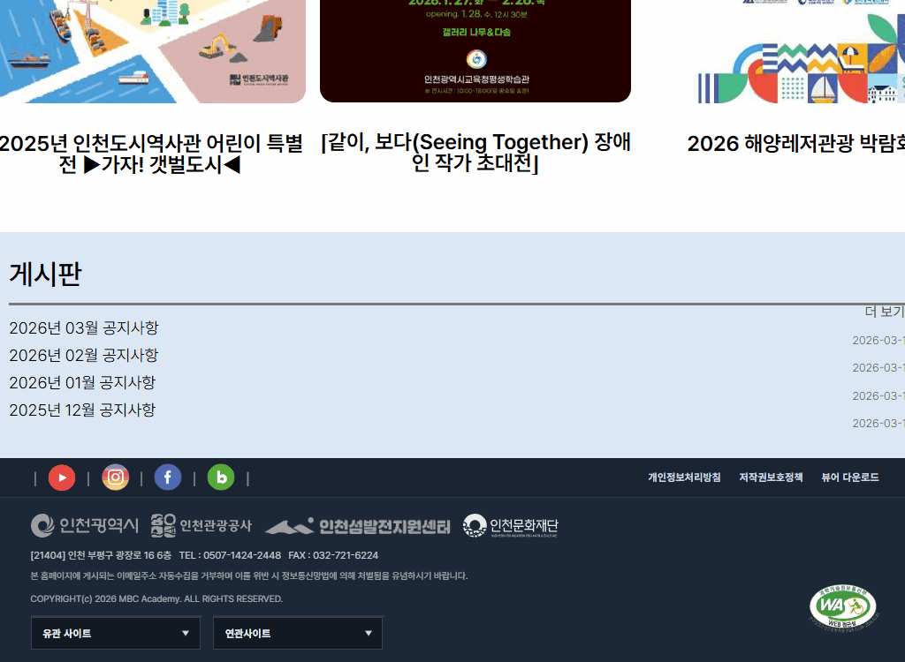

### 12-2. 비회원 접근 화면
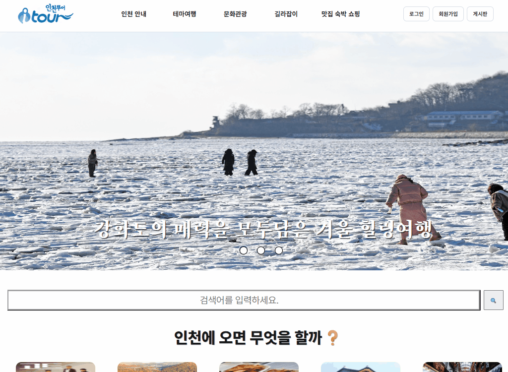

### 12-3. 회원가입
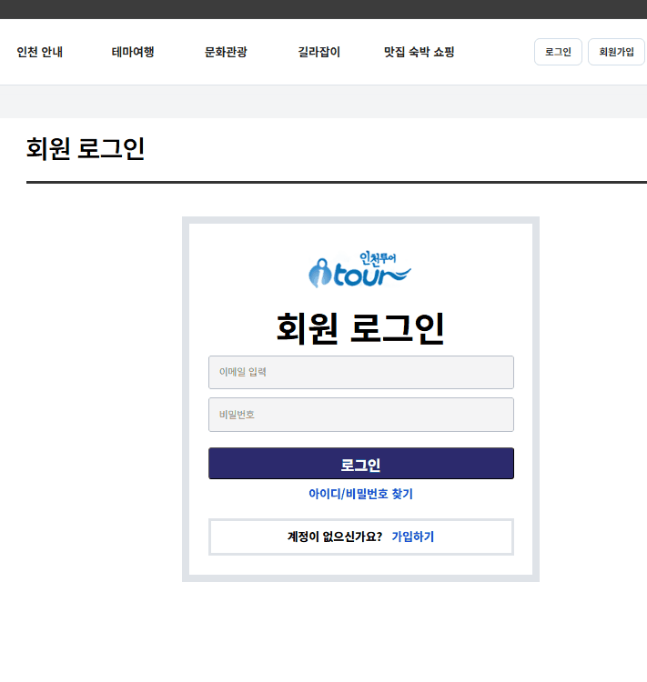

### 12-4. 로그인
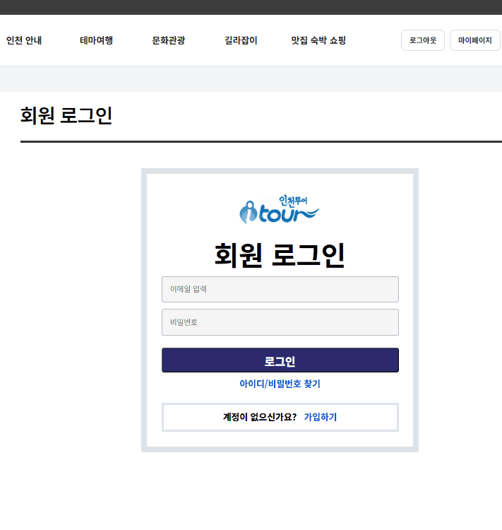

### 12-5. 마이페이지
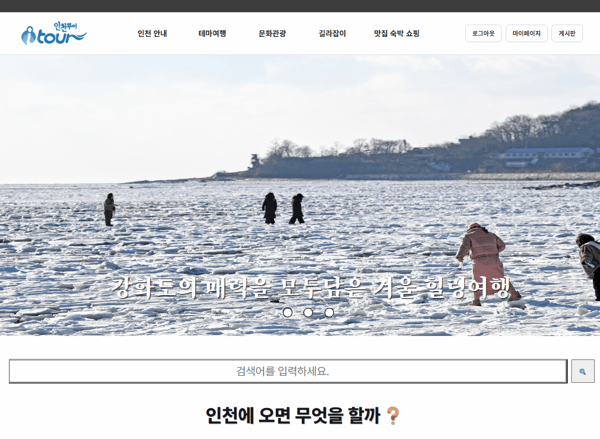

### 12-6. 리뷰 게시판 기능
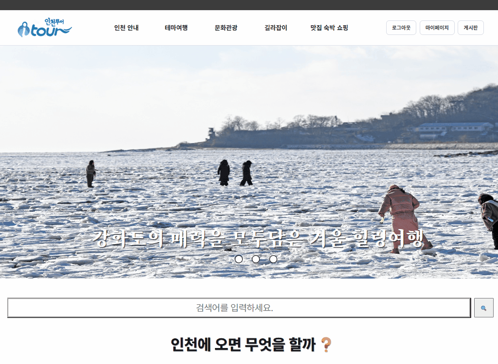
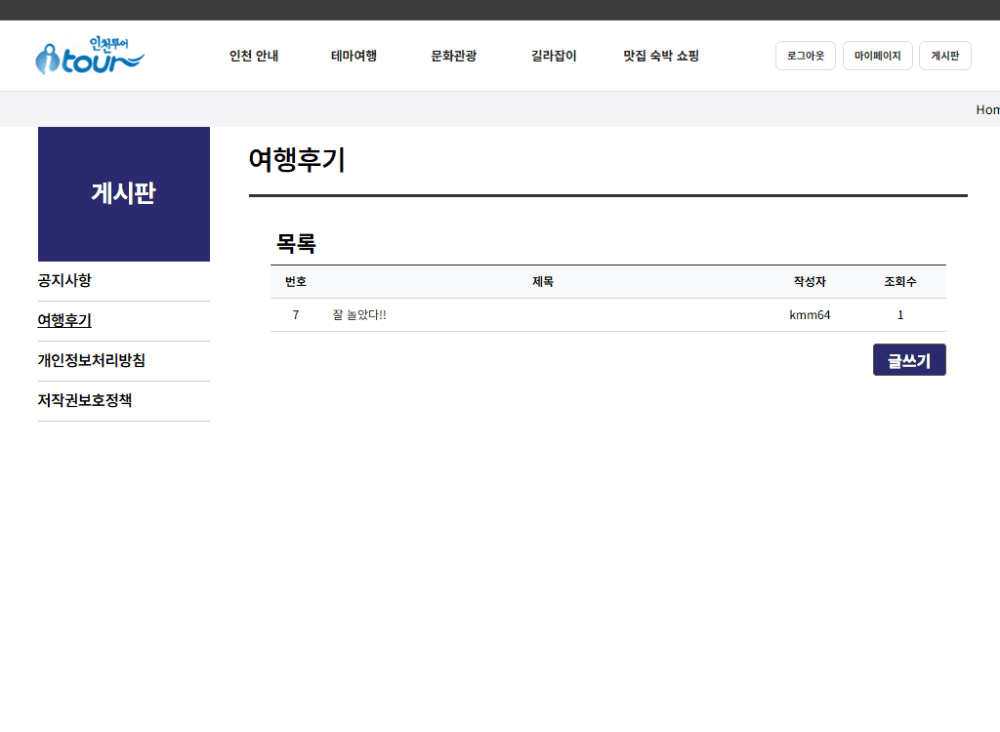

### 12-7. 관리자 기능
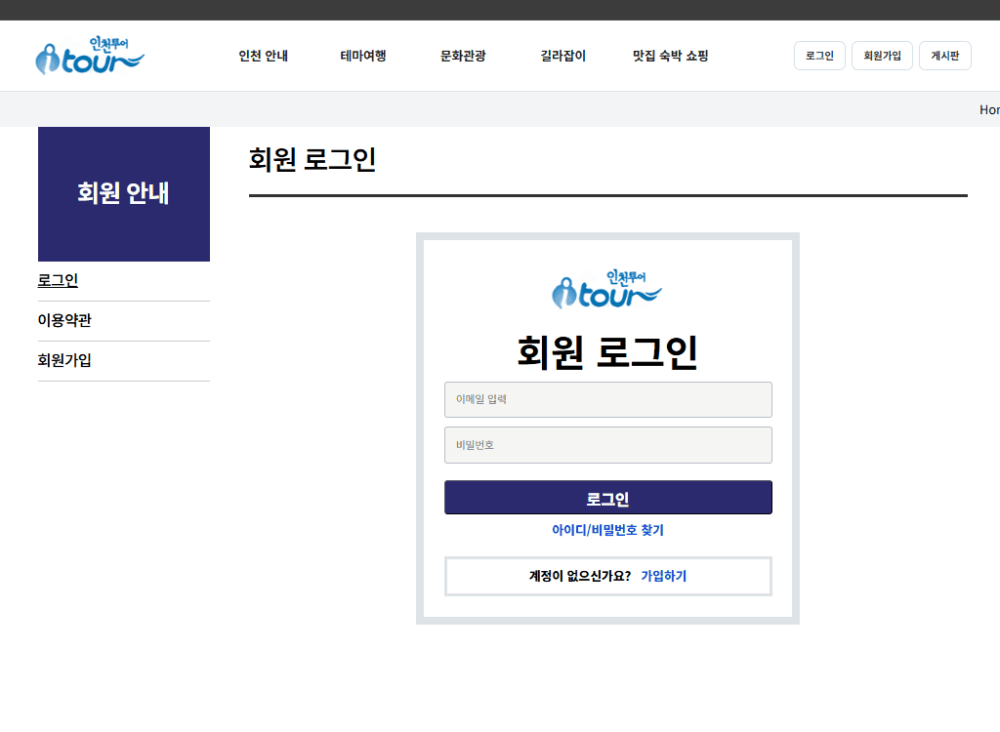
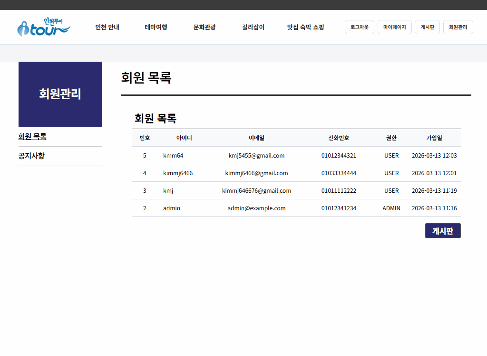
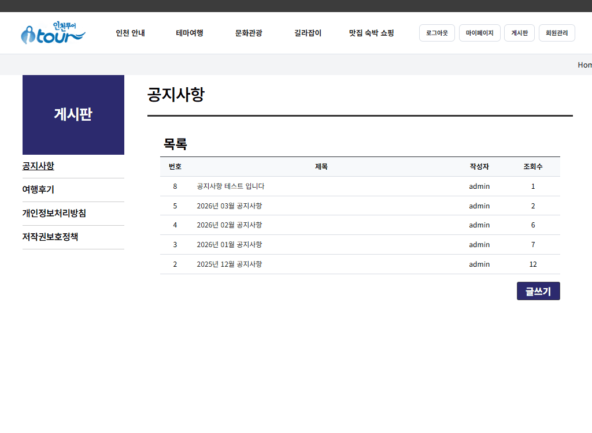

### 12-8. 관광/서브 페이지
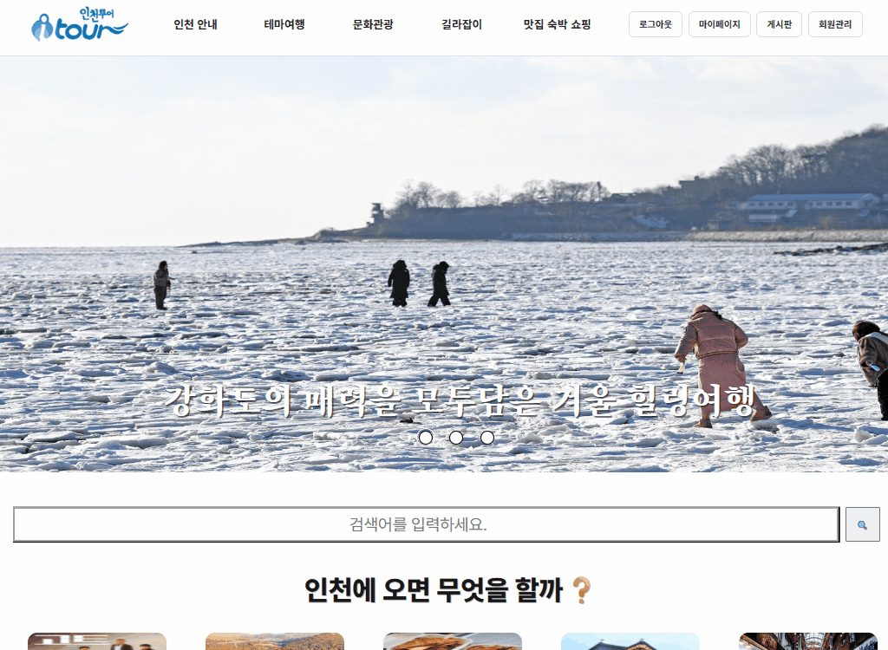

\---

## 13\. 기대 효과

* 인천 지역의 문화·관광 정보를 사용자에게 직관적으로 제공
* 관광 정보와 게시판, 회원 기능을 결합한 통합형 웹 서비스 구현
* Spring Boot 기반 웹 애플리케이션 설계 및 구현 역량 강화
* 데이터베이스 연동, 권한 관리, 파일 업로드 기능 구현 경험 확보
* Docker 기반 배포 확장을 고려한 운영 환경 준비

\---

## 14\. 향후 개선 방향

* 관광 정보 데이터 확장 및 최신화
* UI/UX 개선
* 검색 기능 고도화
* 관리자 기능 확장
* 사용자 편의 기능 추가

\---
