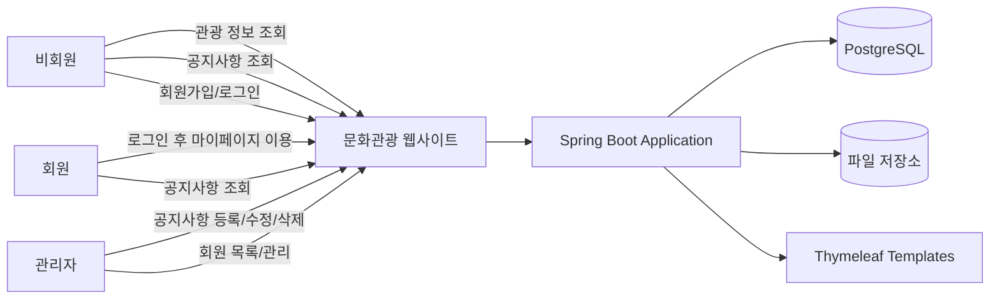
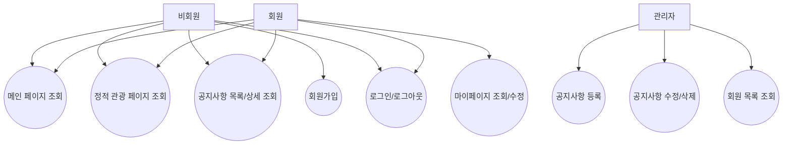
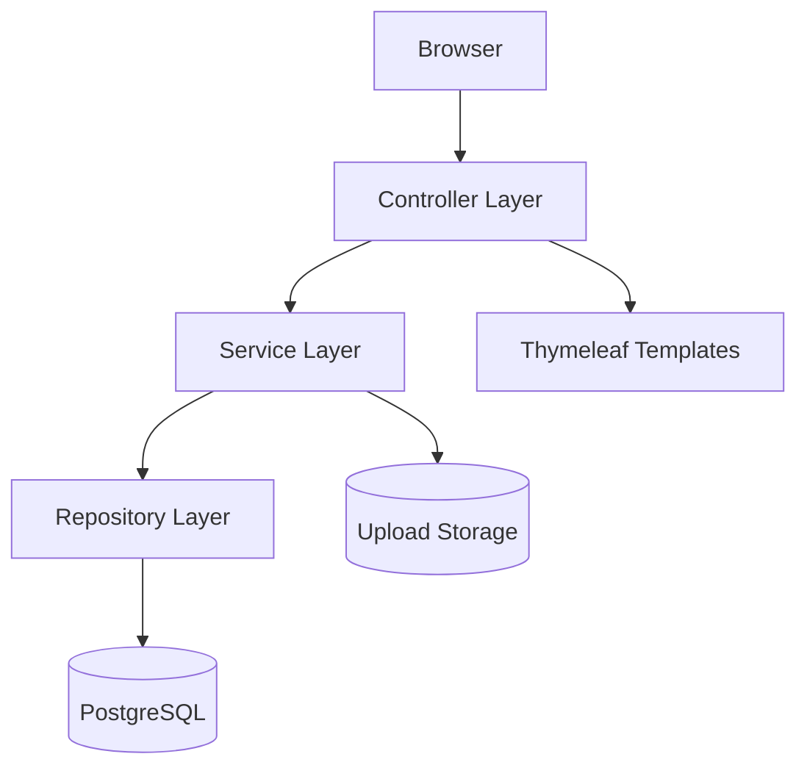
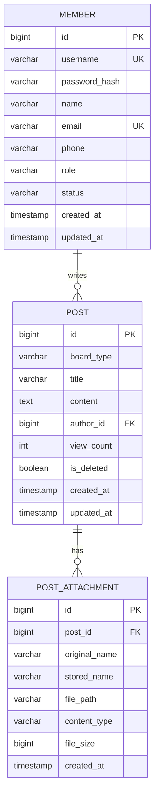
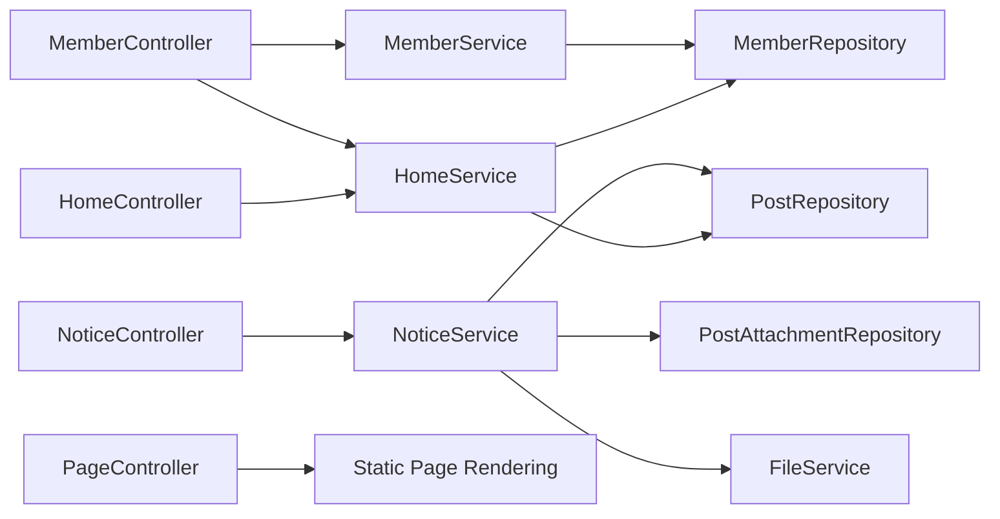
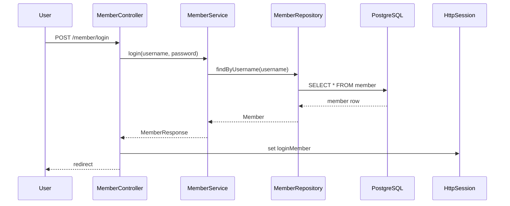
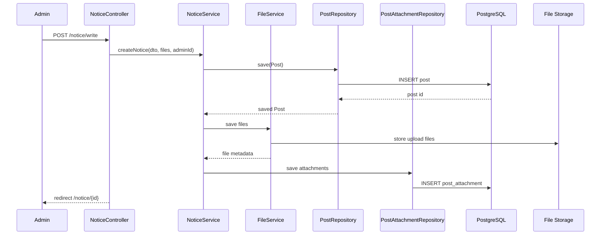

# 인천 문화관광 사이트 Spring 백엔드 통합 설계 산출물

## 0. 문서 목적
이 문서는 다음 목표를 기준으로 작성한 설계 산출물이다.

- **프론트 화면/UX는 `최최종.zip` 기준을 유지**한다.
- **백엔드 구조는 `demo.zip`의 Spring Boot MVC + Thymeleaf + JPA + PostgreSQL 방식**을 따른다.
- 구현 전에 필요한 **개념적 설계 / 논리적 설계 / 물리적 설계**를 노션에 바로 붙여넣을 수 있도록 마크다운과 Mermaid, DB 차트 형태로 정리한다.

---

## 1. 현재 파일 기준 분석 요약

### 1-1. `최최종.zip`에서 확인된 프론트 구조
정적 HTML/CSS 중심 사이트이며 주요 화면은 아래와 같다.

- 메인: `index.html`
- 회원: `login.html`, `join.html`, `terms.html`
- 게시판: `board.html`, `board_detail.html`, `board_form.html`
- 정책: `privacy.html`, `copyright.html`
- 관광/교통/문화 소개: `sub11~sub53.html`

### 1-2. `demo.zip`에서 확인된 백엔드 구조
Spring Boot 기반의 전형적인 MVC 구조다.

- Controller: `HomeController`, `SubController`, `MemberController`, `BoardController`
- Service: `MemberService`, `BoardService`
- Entity: `Member`, `Board`
- Repository: `MemberRepository`, `BoardRepository`
- Config/Interceptor: `WebConfig`, `PasswordConfig`, `LoginCheckInterceptor`
- View: `templates/` + `static/`
- DB: PostgreSQL
- 인증: 세션 기반 로그인

### 1-3. 두 프로젝트를 결합할 때 바로 보이는 갭(gap)
현재 프론트와 demo 백엔드 사이에는 아래 차이가 있다.

1. **회원가입 항목 불일치**
   - 프론트: 아이디, 비밀번호, 이메일, 전화번호
   - demo 백엔드: username, password, name 중심

2. **공지사항 첨부파일 기능 불일치**
   - 프론트 게시글 작성 화면에는 파일 첨부가 있음
   - demo 백엔드 `Board` 엔티티에는 첨부파일 구조가 없음

3. **공지사항/일반게시판 구분 구조 미정**
   - 화면상으로는 현재 `공지사항` 성격이 강함
   - demo는 일반 `board` 중심

4. **정적 관광 소개 페이지의 데이터 관리 방식 미정**
   - 1차는 정적 템플릿 유지 가능
   - 2차부터는 DB/CMS화 검토 가능

---

## 2. 권장 설계 범위

### 2-1. 1차 구축 범위(MVP)
현재 목표와 작업량을 기준으로 하면, 1차는 아래 범위가 가장 적절하다.

- 메인 페이지
- 로그인 / 로그아웃 / 회원가입 / 마이페이지
- 공지사항 목록 / 상세 / 등록 / 수정 / 삭제
- 정적 관광 소개 페이지(`subXX`) 템플릿화
- 세션 기반 인증/인가
- 파일 첨부 1:N

### 2-2. 2차 확장 범위
추후 필요 시 확장한다.

- 관광 콘텐츠 관리자 등록 기능
- 행사/축제/명소 DB화
- 관리자 대시보드
- 배너/메인 노출 관리
- REST API 분리 및 프론트 분리

---

# 3. 개념적 설계

## 3-1. 개념적 설계 요약
이 시스템의 핵심 도메인은 아래 5개다.

- **방문자(Guest)**: 관광 정보 열람, 공지 확인
- **회원(Member)**: 로그인, 내 정보 관리
- **관리자(Admin)**: 공지사항 등록/수정/삭제, 회원 관리
- **공지사항(Notice/Post)**: 공지 게시물 본문과 첨부파일
- **정적 관광 콘텐츠(Static Page)**: 현재는 템플릿 기반 페이지

핵심 포인트는 다음과 같다.

- 관광 소개 페이지는 **1차에서는 DB화하지 않고 템플릿 유지**
- 동적인 기능은 **회원/공지사항 중심으로 우선 구축**
- demo 구조를 따르되, 실제 프론트 폼에 맞게 **회원/첨부파일 모델을 확장**

## 3-2. 개념적 시스템 다이어그램 (Mermaid)


## 3-3. 개념적 유스케이스 다이어그램 (Mermaid)


## 3-4. 개념적 데이터 대상
1차 기준으로 실제 DB 관리가 필요한 대상은 아래와 같다.

- 회원
- 공지사항 게시글
- 첨부파일
- 세션(애플리케이션/서버 레벨 관리)

현재 `sub11 ~ sub53`, `privacy`, `copyright`, `terms`는 **템플릿 자원**으로 관리하는 것이 적절하다.

---

# 4. 논리적 설계

## 4-1. 논리 아키텍처
`demo.zip` 구조를 유지하되, 실제 요구사항에 맞게 확장한 논리 계층은 아래와 같다.



## 4-2. 권장 패키지 구조
```text
com.project.tour
├─ config
│  ├─ WebConfig
│  ├─ PasswordConfig
│  └─ FileStorageConfig
├─ interceptor
│  └─ LoginCheckInterceptor
├─ controller
│  ├─ HomeController
│  ├─ MemberController
│  ├─ NoticeController
│  ├─ PageController
│  └─ AdminController
├─ dto
│  ├─ member
│  ├─ notice
│  └─ common
├─ entity
│  ├─ Member
│  ├─ Post
│  └─ PostAttachment
├─ repository
│  ├─ MemberRepository
│  ├─ PostRepository
│  └─ PostAttachmentRepository
├─ service
│  ├─ MemberService
│  ├─ NoticeService
│  ├─ HomeService
│  └─ FileService
└─ common
   ├─ exception
   ├─ response
   └─ util
```

## 4-3. URL 설계

### 공개 페이지
| 기능 | 기존 프론트 파일 | 권장 URL | View 템플릿 |
|---|---|---|---|
| 메인 | `index.html` | `/` | `templates/index.html` |
| 로그인 | `login.html` | `/member/login` | `templates/member/login.html` |
| 회원가입 | `join.html` | `/member/join` | `templates/member/join.html` |
| 이용약관 | `terms.html` | `/terms` | `templates/policy/terms.html` |
| 개인정보처리방침 | `privacy.html` | `/privacy` | `templates/policy/privacy.html` |
| 저작권정책 | `copyright.html` | `/copyright` | `templates/policy/copyright.html` |
| 공지사항 목록 | `board.html` | `/notice/list` | `templates/notice/list.html` |
| 공지사항 상세 | `board_detail.html` | `/notice/{id}` | `templates/notice/detail.html` |
| 관광 정적 페이지 | `subXX.html` | `/pages/sub11` 등 | `templates/pages/...` |

### 인증 필요 페이지
| 기능 | 기존 프론트 파일 | 권장 URL | View 템플릿 |
|---|---|---|---|
| 로그아웃 | - | `/member/logout` | redirect |
| 마이페이지 | - | `/member/mypage` | `templates/member/mypage.html` |
| 회원정보수정 | - | `/member/edit` | `templates/member/edit.html` |
| 공지사항 등록 | `board_form.html` | `/notice/write` | `templates/notice/write.html` |
| 공지사항 수정 | `board_form.html` 재사용 | `/notice/edit/{id}` | `templates/notice/edit.html` |

### 관리자 페이지
| 기능 | 권장 URL | 설명 |
|---|---|---|
| 회원 목록 | `/admin/members` | 관리자 전용 |
| 회원 상세 | `/admin/members/{id}` | 관리자 전용 |
| 공지사항 관리 | `/admin/notices` | 필요 시 별도 분리 |

## 4-4. 화면-기능 논리 매핑

### 회원 도메인
- 회원가입
- 로그인/로그아웃
- 내 정보 조회/수정
- 관리자 회원 조회

### 공지사항 도메인
- 목록 조회
- 상세 조회
- 검색
- 조회수 증가
- 첨부파일 다운로드
- 관리자 글 작성/수정/삭제

### 페이지 도메인
- 정적 관광 페이지 렌더링
- 헤더/푸터/공통 레이아웃 재사용

## 4-5. 논리 ERD (Mermaid)
1차 범위 기준 핵심 엔티티만 반영한 논리 모델이다.



## 4-6. 논리 클래스/레이어 관계도 (Mermaid)


## 4-7. 시퀀스 다이어그램 - 로그인


## 4-8. 시퀀스 다이어그램 - 공지사항 작성


## 4-9. 논리 설계에서 반드시 반영할 정책

### 인증/인가 정책
- 비회원: 공지사항 조회, 정적 페이지 조회 가능
- 회원: 로그인, 마이페이지 가능
- 관리자: 공지 작성/수정/삭제, 회원 목록 조회 가능
- 1차는 demo 방식처럼 **세션 + 인터셉터** 유지

### 데이터 정책
- 공지사항 삭제는 물리 삭제보다 **논리 삭제(`is_deleted`)** 권장
- 비밀번호는 BCrypt 해시 저장
- 첨부파일은 DB가 아니라 **파일 시스템 + 메타데이터 DB 저장** 권장

### UI 연동 정책
- `최최종.zip`의 HTML은 Thymeleaf 템플릿으로 전환
- 헤더/푸터/공통 메뉴는 fragment 또는 layout 템플릿화
- `board_form.html`의 작성자 입력칸은 **세션 사용자 기반 자동 주입**으로 바꾸는 것이 적절

---

# 5. 물리적 설계

## 5-1. 물리 배포 구조
```mermaid
flowchart TB
    Browser[사용자 브라우저]
    Nginx[Nginx 또는 내장 서버]
    Spring[Spring Boot Jar]
    PG[(PostgreSQL)]
    Upload[/upload/notice]

    Browser --> Nginx
    Nginx --> Spring
    Spring --> PG
    Spring --> Upload
```

## 5-2. 물리 디렉터리 구조 권장안
```text
project-root/
├─ src/main/java/com/project/tour
├─ src/main/resources/
│  ├─ templates/
│  │  ├─ layout/
│  │  ├─ fragments/
│  │  ├─ member/
│  │  ├─ notice/
│  │  ├─ pages/
│  │  └─ policy/
│  ├─ static/
│  │  ├─ css/
│  │  ├─ js/
│  │  ├─ images/
│  │  └─ fonts/
│  └─ application.yml
└─ uploads/
   └─ notice/
      └─ 2026/03/
```

## 5-3. 물리 DB 테이블 정의

### `member`
| 컬럼명 | 타입 | 제약 | 설명 |
|---|---|---|---|
| id | BIGSERIAL | PK | 회원 ID |
| username | VARCHAR(50) | NOT NULL, UNIQUE | 로그인 아이디 |
| password_hash | VARCHAR(255) | NOT NULL | BCrypt 암호문 |
| name | VARCHAR(50) | NOT NULL | 이름 |
| email | VARCHAR(100) | NOT NULL, UNIQUE | 이메일 |
| phone | VARCHAR(20) | NULL | 전화번호 |
| role | VARCHAR(20) | NOT NULL DEFAULT 'USER' | USER / ADMIN |
| status | VARCHAR(20) | NOT NULL DEFAULT 'ACTIVE' | ACTIVE / INACTIVE / DELETED |
| created_at | TIMESTAMP | NOT NULL | 생성일시 |
| updated_at | TIMESTAMP | NOT NULL | 수정일시 |

### `post`
| 컬럼명 | 타입 | 제약 | 설명 |
|---|---|---|---|
| id | BIGSERIAL | PK | 게시글 ID |
| board_type | VARCHAR(30) | NOT NULL | NOTICE 고정 또는 확장용 |
| title | VARCHAR(255) | NOT NULL | 제목 |
| content | TEXT | NOT NULL | 본문 |
| author_id | BIGINT | NOT NULL, FK | 작성자 회원 ID |
| view_count | INTEGER | NOT NULL DEFAULT 0 | 조회수 |
| is_deleted | BOOLEAN | NOT NULL DEFAULT FALSE | 삭제 여부 |
| created_at | TIMESTAMP | NOT NULL | 생성일시 |
| updated_at | TIMESTAMP | NOT NULL | 수정일시 |

### `post_attachment`
| 컬럼명 | 타입 | 제약 | 설명 |
|---|---|---|---|
| id | BIGSERIAL | PK | 첨부파일 ID |
| post_id | BIGINT | NOT NULL, FK | 게시글 ID |
| original_name | VARCHAR(255) | NOT NULL | 원본 파일명 |
| stored_name | VARCHAR(255) | NOT NULL | 서버 저장 파일명 |
| file_path | VARCHAR(500) | NOT NULL | 저장 경로 |
| content_type | VARCHAR(100) | NULL | MIME Type |
| file_size | BIGINT | NOT NULL | 파일 크기 |
| created_at | TIMESTAMP | NOT NULL | 업로드 시각 |

## 5-4. 권장 인덱스
```sql
CREATE UNIQUE INDEX ux_member_username ON member(username);
CREATE UNIQUE INDEX ux_member_email ON member(email);
CREATE INDEX ix_post_board_type_created_at ON post(board_type, created_at DESC);
CREATE INDEX ix_post_author_id ON post(author_id);
CREATE INDEX ix_post_is_deleted ON post(is_deleted);
CREATE INDEX ix_attachment_post_id ON post_attachment(post_id);
```

## 5-5. PostgreSQL DDL 초안
```sql
CREATE TABLE member (
    id BIGSERIAL PRIMARY KEY,
    username VARCHAR(50) NOT NULL UNIQUE,
    password_hash VARCHAR(255) NOT NULL,
    name VARCHAR(50) NOT NULL,
    email VARCHAR(100) NOT NULL UNIQUE,
    phone VARCHAR(20),
    role VARCHAR(20) NOT NULL DEFAULT 'USER',
    status VARCHAR(20) NOT NULL DEFAULT 'ACTIVE',
    created_at TIMESTAMP NOT NULL DEFAULT CURRENT_TIMESTAMP,
    updated_at TIMESTAMP NOT NULL DEFAULT CURRENT_TIMESTAMP
);

CREATE TABLE post (
    id BIGSERIAL PRIMARY KEY,
    board_type VARCHAR(30) NOT NULL DEFAULT 'NOTICE',
    title VARCHAR(255) NOT NULL,
    content TEXT NOT NULL,
    author_id BIGINT NOT NULL,
    view_count INTEGER NOT NULL DEFAULT 0,
    is_deleted BOOLEAN NOT NULL DEFAULT FALSE,
    created_at TIMESTAMP NOT NULL DEFAULT CURRENT_TIMESTAMP,
    updated_at TIMESTAMP NOT NULL DEFAULT CURRENT_TIMESTAMP,
    CONSTRAINT fk_post_author
        FOREIGN KEY (author_id) REFERENCES member(id)
);

CREATE TABLE post_attachment (
    id BIGSERIAL PRIMARY KEY,
    post_id BIGINT NOT NULL,
    original_name VARCHAR(255) NOT NULL,
    stored_name VARCHAR(255) NOT NULL,
    file_path VARCHAR(500) NOT NULL,
    content_type VARCHAR(100),
    file_size BIGINT NOT NULL,
    created_at TIMESTAMP NOT NULL DEFAULT CURRENT_TIMESTAMP,
    CONSTRAINT fk_attachment_post
        FOREIGN KEY (post_id) REFERENCES post(id) ON DELETE CASCADE
);

CREATE UNIQUE INDEX ux_member_username ON member(username);
CREATE UNIQUE INDEX ux_member_email ON member(email);
CREATE INDEX ix_post_board_type_created_at ON post(board_type, created_at DESC);
CREATE INDEX ix_post_author_id ON post(author_id);
CREATE INDEX ix_post_is_deleted ON post(is_deleted);
CREATE INDEX ix_attachment_post_id ON post_attachment(post_id);
```

## 5-6. DB 차트용 DBML
아래 코드는 dbdiagram.io 등에 붙여넣기 좋다.

```dbml
Table member {
  id bigint [pk, increment]
  username varchar(50) [not null, unique]
  password_hash varchar(255) [not null]
  name varchar(50) [not null]
  email varchar(100) [not null, unique]
  phone varchar(20)
  role varchar(20) [not null, default: 'USER']
  status varchar(20) [not null, default: 'ACTIVE']
  created_at timestamp [not null]
  updated_at timestamp [not null]
}

Table post {
  id bigint [pk, increment]
  board_type varchar(30) [not null, default: 'NOTICE']
  title varchar(255) [not null]
  content text [not null]
  author_id bigint [not null]
  view_count int [not null, default: 0]
  is_deleted boolean [not null, default: false]
  created_at timestamp [not null]
  updated_at timestamp [not null]
}

Table post_attachment {
  id bigint [pk, increment]
  post_id bigint [not null]
  original_name varchar(255) [not null]
  stored_name varchar(255) [not null]
  file_path varchar(500) [not null]
  content_type varchar(100)
  file_size bigint [not null]
  created_at timestamp [not null]
}

Ref: post.author_id > member.id
Ref: post_attachment.post_id > post.id
```

## 5-7. application.yml 예시
```yaml
server:
  port: 8080
  servlet:
    session:
      timeout: 30m
      cookie:
        name: TOURSESSION
        http-only: true

spring:
  datasource:
    url: jdbc:postgresql://localhost:5432/incheon_tour
    username: postgres
    password: 1004
  jpa:
    hibernate:
      ddl-auto: update
    show-sql: true
    properties:
      hibernate:
        format_sql: true
  thymeleaf:
    cache: false
    prefix: classpath:/templates/
    suffix: .html
    encoding: UTF-8

app:
  upload:
    base-dir: ./uploads
    notice-dir: ./uploads/notice
```

---

# 6. 프론트 유지 + 백엔드 적용 방식

## 6-1. 변환 원칙
`최최종.zip`의 화면을 유지하려면 아래 원칙으로 옮기는 것이 가장 안전하다.

1. HTML을 그대로 복사하지 말고 **Thymeleaf 템플릿으로 치환**
2. 공통 헤더/푸터를 **fragment 분리**
3. 이미지/CSS/fonts는 `static/`으로 이동
4. 링크를 `.html` 파일 경로가 아니라 **Spring URL로 변경**
5. 하드코딩 데이터는 점진적으로 `${}` 바인딩으로 대체

## 6-2. 예시 매핑
```text
index.html                -> templates/index.html
login.html                -> templates/member/login.html
join.html                 -> templates/member/join.html
board.html                -> templates/notice/list.html
board_detail.html         -> templates/notice/detail.html
board_form.html           -> templates/notice/write.html, edit.html
sub11.html ~ sub53.html   -> templates/pages/sub11.html ~ sub53.html
privacy.html              -> templates/policy/privacy.html
copyright.html            -> templates/policy/copyright.html
terms.html                -> templates/policy/terms.html
```

## 6-3. 폼 항목 조정 포인트

### 로그인 화면
현재 프론트는 입력 placeholder가 이메일처럼 보이지만, 실제 demo 구조는 `username` 로그인이다.
따라서 아래 둘 중 하나를 선택해야 한다.

- **안 A**: 로그인 아이디는 `username` 유지, placeholder 문구만 수정
- **안 B**: 이메일 로그인으로 변경, DB/로직 전체 수정

현재 작업 목표상 **안 A가 더 안전**하다.

### 회원가입 화면
프론트에는 `email`, `tel`이 있으므로 백엔드 엔티티와 DTO에 반드시 반영해야 한다.

### 게시글 작성 화면
프론트에는 작성자 직접 입력칸이 있으나 실제 서비스에서는 아래 방식이 적절하다.

- 로그인 사용자 이름 자동 표시
- 실제 저장은 `author_id` 세션 기반 처리
- 작성자 input은 read-only 또는 hidden 처리

---

# 7. 구현 우선순위 제안

## 7-1. 1단계
- Spring 프로젝트 기본 구조 생성
- static / templates 분리
- 공통 layout 적용
- 메인/정적 페이지 라우팅 완료

## 7-2. 2단계
- 회원가입 / 로그인 / 로그아웃 / 세션 처리
- 마이페이지 구현
- 관리자 판별 로직 추가

## 7-3. 3단계
- 공지사항 CRUD
- 검색 / 페이징
- 첨부파일 업로드 / 다운로드

## 7-4. 4단계
- 화면 데이터 바인딩 정리
- 예외 처리 / 유효성 검사 / 메시지 정리
- 관리자 화면 정비

---

# 8. 최종 권장안

## 핵심 결론
이번 통합은 아래 방향이 가장 현실적이다.

1. **프론트 화면은 그대로 유지**한다.
2. **백엔드는 demo의 MVC 구조를 그대로 가져간다.**
3. 다만 실제 프론트 요구사항에 맞춰 아래 3개는 반드시 확장한다.
   - `Member`에 `email`, `phone`, `role`, `status` 추가
   - `Board`를 `Post/Notice` 구조로 정리
   - `Attachment` 테이블 및 파일 저장 구조 추가
4. `subXX` 관광 페이지는 1차에서는 **정적 템플릿 유지**가 적절하다.
5. 공지사항은 단일 `post` 테이블 + `board_type='NOTICE'` 방식이 가장 확장성이 좋다.

---

# 9. 바로 복붙 가능한 간단 요약본
```md
- 프론트: 최최종.zip 유지
- 백엔드: demo.zip 구조(Spring Boot + Thymeleaf + JPA + PostgreSQL) 채택
- 1차 동적화 범위: 회원, 로그인, 마이페이지, 공지사항, 첨부파일
- 정적 관광 페이지(subXX): 1차는 템플릿 유지
- 핵심 테이블: member, post, post_attachment
- 인증 방식: 세션 + 인터셉터
- 공지사항 구조: post 테이블에서 board_type='NOTICE' 사용
- 프론트 보정 포인트:
  - 회원가입 폼의 email/tel을 백엔드에 반영
  - 게시글 작성자의 직접 입력 제거, 세션 사용자 기반 저장
  - login placeholder는 username 기준으로 정리
```
